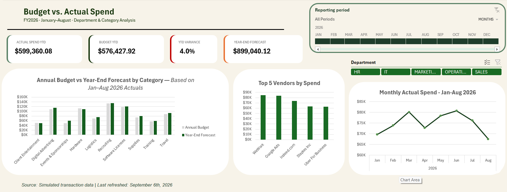

# Budget vs. Actual Excel Dashboard

An Excel FP&A project analyzing operating expenses against budget and forecasting year-end spending based on January-August 2026 actuals.

## Project Overview

This project simulates a corporate budget-versus-actual reporting process. Eight monthly transaction files were imported, combined and cleaned with Power Query. The cleaned data was then used to calculate year-to-date performance, forecast year-end spending and build an interactive Excel dashboard.

## Business questions

- How does actual spending compare with the year-to-date budget?
- Which departments and categories are over or under budget?
- What is the projected year-end spending?
- Which vendors receive the highest spending?
- How does spending change from month to month?

## Tools and skills

- Microsoft Excel
- Power Query
- PivotTables and PivotCharts
- Slicers and timeline filtering
- `SUMIFS` and lookup formulas
- Conditional formatting
- Budget variance analysis
- Year-end forecasting
- Dashboard design

## Data preparation

Power Query was used to:

- Import and combine eight monthly CSV files
- Remove blank transaction rows
- Standardize dates and data types
- Trim and clean text values
- Standardize department, category and vendor names
- Preserve the source filename for data traceability
- Create a repeatable process that can be refreshed when new files are added
  
The refresh process was tested by adding a temporary September transaction file. Power Query detected and transformed the new file automatically, and the transaction was removed successfully when the test file was deleted.

## Calculations

The analysis includes:

- Actual spend YTD
- Budget YTD
- YTD variance in dollars and percentage
- Annual budget
- Year-end forecast
- Forecast variance in dollars and percentage
- Variance status classification

The year-end forecast uses the average monthly spending from January–August and annualizes it over 12 months.

## Key findings

- Actual spending YTD: **$599,360.08**
- Budget YTD: **$576,427.92**
- YTD spending is approximately **4.0% over budget**
- Year-end forecast: **$899,040.12**
- Annual budget: **$864,641.88**
- Events & Sponsorships has the largest projected percentage overrun
- Hardware and Client Entertainment are projected to finish under budget

## Dashboard features

- Budget versus year-end forecast comparison
- Monthly actual-spending trend
- Top-five vendors by spending
- Department and category slicers
- Reporting-period timeline
- KPI cards for actuals, budget, variance and forecast

## Repository contents

- `Budget_vs_Actual_Forecast_Dashboard.xlsx` — completed Excel workbook
- `dashboard_preview.png` — dashboard preview
- `data/actuals/` — eight monthly actual-spending CSV files
- `data/budget/` — monthly budget reference CSV

## How to use

1. Download the complete repository.
2. Open `Budget_vs_Actual_Forecast_Dashboard.xlsx` in Microsoft Excel.
3. The saved dashboard can be reviewed without refreshing the connections.
4. To refresh the workbook, update the `raw_data` Power Query source to `data/actuals`.
5. Update the budget query source to `data/budget`.
6. Select **Data → Refresh All**.

## Security note

This workbook contains no macros. Excel may display a security warning because Power Query connects to the included CSV files. The saved dashboard can be viewed without enabling the connections. Enable content only if you want to refresh the queries.

## Data note

The dataset is simulated for portfolio and educational purposes.
